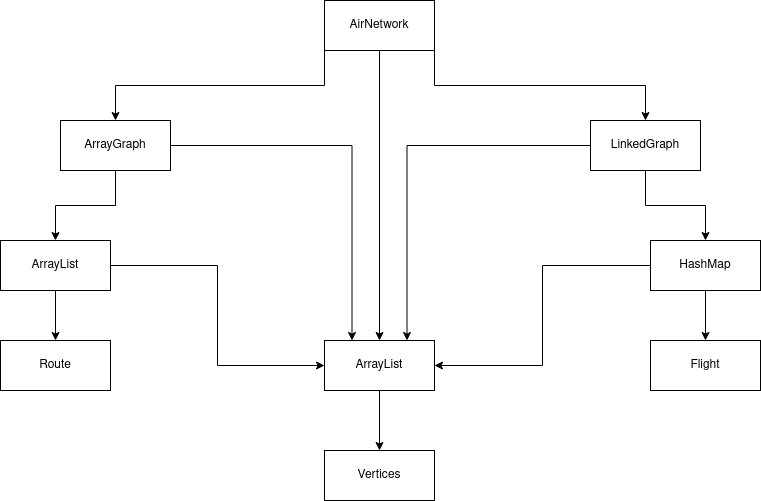

# Simulador de Voo

## Introdução

A ideia deste trabalho é a manipulação de grafos, desde à definição da estrutrura
até implementações de algoritmos. Uma observação importante é que não é permitido
assumir nenhuma estrutura pronta, tornando necessário a implementação de todas as
estruturas que forem necessárias.

Apesar do trabalho ter um escopo definido estritamente para aeroportos, rotas e voos,
sendo estes, a composição de nossos grafos (vértices e arestas respectivamente), todas
as estruturas foram implementadas de maneira genérica, onde é possível usar qualquer
outra estrutra para representar os vértices e arestas. O mesmo se aplica para os algoritmos
criados.

## Desenvolvimento

### Estruturas de Aplicação

Como mencionado anteriormente, teremos arestas de rotas e voos e aeroportos como vertices,
para isso, foram utilizadas duas estruturas de grafos, uma contendo as adjacencias de rotas e
a outra as de voos. Porém, isso foi feito de maneira que ambas compartilham dos mesmos
vertices.

Para isso, foi criada a estrutura `AirNetworks`, onde a mesma irá conter os vertices a serem
compartilhados e os grafos em si. Para representação dos vertices e arestas, foram criadas
as estruturas `Airport`, `Routes` e `Flight` respectivamente.

- **AirNetwork**: Contêm a referência dos grafos e dos vértices compartilhados.
- **Airport**: Representa o aeroporto, trazendo consigo as informações do mesmo.
- **Routes**: Exprime informações da rota, como a sua distância.
- **Flight**: Referente ao voo, possuindo suas informações, como: número do voo,
  distância, número de paradas e duração.

### Estruturas internas

Para o funcionamento da aplicação, foram criadas as estruturas de grafos `LinkedGraph` e
`ArrayGraph` onde ambas implementam uma interface `Graph` que contêm o contrato de métodos
comuns em ambos tipos de grafos.

O `ArrayGraph` funciona como uma matriz de adjacência, onde criasse uma matriz do tipo
`ArrayList` para representar as arestas. Já a estrutura `LinkedGraph` utiliza `HashMap`
para representação de suas arestas, funcionado assim como um vetor de lista de adjacência.
Um ponto a ser levantado é que o uso de uma tabela hash neste caso seria o nosso `HashMap`
um para manipulação aoinvés de um simples array é a eficiencia na busca de dados.

- **ArrayList**: Implementa um vetor dinâmico de dados, com realocação automática.
- **HashMap**: Simboliza uma tabela hash, onde as colisões são tratadas criando uma
  lista de adjacência para os respecitivos indices.
- **ArrayGraph**: Grafo que faz uso de matriz de adjacência em seu funcionamento.
- **LinkedGraph**: Grafo que faz uso de lista de adjacência em seu funcionamento.

### Algoritmos

Diversos algoritmos são utilizados para manipular grafos, neste projeto foram utilizados
BFS(Breadth-First Search) para chegar de um vértice ao outro quando não deve-se considerar
ponderamento de arestas. Dijkstra para encontrar o caminho mais curto em um grafo onde, deve-se
considerar ponderamento de arestas e DFS(Depth-First Search) com Backtracking para verificar
se existe um caminho Hamiltoniano para um dado vértice.

Para o BFS, foi criado a estrutura auxilar de fila: `Queue`, para que fosse possível a
implementação do mesmo. Já para o Dikstra, foi criado uma fila de prioridade: `PriorityQueue`.
Para o DFS, usa-se da pilha de recursão, discartando necessidade de estruturas auxiliares.

- **Queue**: Estrutura simples de fila, que implementa a ideia de FIFO(First-In-First-Out).
- **ProprityQueue**: Funciona de maneira semelhante a `Queue`, porém aquele que possuir menor
  valor, terá prioridade no momento de entrar na fila. Ideia esta que convêm usar no Dijsktra
  já que o mesmo sempre terá como próximo, o menor valor (oriundo da escolha gulosa).

Vale ressaltar que nem todos algoritmos desses são em tempo polinomial, como o de caminho
Hamiltoniano por exemplo. E algoritmos de exploração em largura, tendem a ocupar maior
espaço na memória.

O diagrama das conexões entre as estruturas pode ser dada pelo diagrama:

## Conclusão

Em conclusão, este projeto de simulador de voo envolve a manipulação de grafos, desde a definição da estrutura até a
implementação de algoritmos. Uma abordagem genérica foi adotada, permitindo a representação
de maneira flexível.

Vale ressaltar que a escolha entre estruturas e algoritmos deve considerar as características específicas do problema,
como a eficiência na busca de dados e a ocupação de memória. O diagrama de conexões entre as estruturas fornece uma
visão visual das relações estabelecidas no simulador de voo.